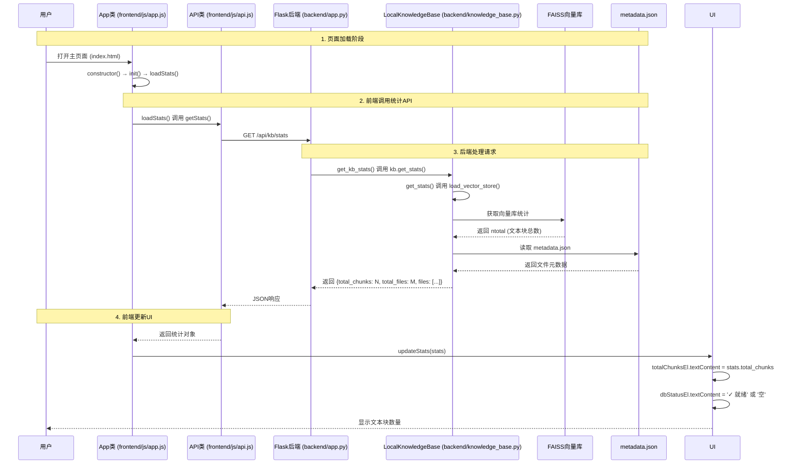

**主页面显示知识库文本块数量的具体时序图**



---

## **具体文件路径和函数调用关系**

| 步骤 | 文件路径                       | 函数/方法                                          | 说明                            |
| ---- | ------------------------------ | -------------------------------------------------- | ------------------------------- |
| 1    | app.js                         | `constructor()` → `init()` → `loadStats()` | 应用初始化时自动加载统计        |
| 2    | app.js                         | `loadStats()`                                    | 调用API获取统计信息             |
| 3    | api.js                         | `getStats()`                                     | 发送GET请求到 `/api/kb/stats` |
| 4    | app.py                         | `get_kb_stats()`                                 | Flask路由处理函数               |
| 5    | knowledge_base.py              | `get_stats()`                                    | 知识库统计方法                  |
| 6    | knowledge_base.py              | `load_vector_store()`                            | 加载FAISS向量库                 |
| 7    | `knowledge_db/faiss_index/`  | `index.faiss`                                    | 存储向量数据的FAISS索引         |
| 8    | `knowledge_db/metadata.json` | JSON文件                                           | 存储文件元数据和分块信息        |
| 9    | ui.js                          | `updateStats(stats)`                             | 更新UI显示统计信息              |
| 10   | index.html                     | `#totalChunks`元素                               | 显示文本块数量的DOM元素         |

---

## **关键代码片段**

### 1. **前端加载统计 (`app.js:265-273`)**

```javascript
async loadStats() {
    try {
        const stats = await this.api.getStats();
        this.ui.updateStats(stats);
        this.ui.updateDocumentsList(stats.files || []);
    } catch (error) {
        console.error('加载统计失败:', error);
    }
}
```

### 2. **API调用 (`api.js:50-53`)**

```javascript
async getStats() {
    return this.request('GET', '/kb/stats');
}
```

### 3. **后端路由 (`app.py:70-83`)**

```python
@app.route('/api/kb/stats', methods=['GET', 'OPTIONS'])  
def get_kb_stats():
    if request.method == 'OPTIONS':  
        return '', 204
  
    if not kb:
        return jsonify({'error': '知识库未初始化'}), 500
  
    try:
        stats = kb.get_stats()
        return jsonify(stats), 200
    except Exception as e:
        return jsonify({'error': str(e)}), 500
```

### 4. **知识库统计方法 (`knowledge_base.py:542-555`)**

```python
def get_stats(self) -> Dict:
    """获取知识库统计信息"""
    try:
        self.load_vector_store()
      
        total_chunks = self.vector_store.index.ntotal if self.vector_store else 0
        files = [
            {
                'name': filename,
                'path': metadata.get('path', ''),
                'added_time': metadata.get('added_time', '')
            }
            for filename, metadata in self.file_metadata.items()
        ]
      
        return {
            'total_chunks': total_chunks,
            'total_files': len(files),
            'files': files
        }
```

### 5. **UI更新 (`ui.js:333-338`)**

```javascript
updateStats(stats) {
    this.totalChunksEl.textContent = stats.total_chunks || 0;
    this.dbStatusEl.textContent = stats.total_chunks > 0 ? '✓ 就绪' : '空';
    this.dbStatusEl.style.color = stats.total_chunks > 0 ? '#51cf66' : '#ff6b6b';
}
```

---

已完成: *绘制具体时序图* (2/3)

这个时序图展示了从用户打开页面到显示文本块数量的完整调用链，包含了具体的文件路径和函数名。你的系统已经实现了这个功能，通过 `/api/kb/stats`端点获取FAISS向量库中的 `ntotal`属性来统计文本块数量。
