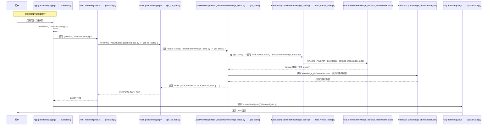

# 显示知识库中的文本块状态

本文档说明主页面显示知识库中文本块数量（total_chunks）的调用链，具体到文件与函数，包含 Mermaid 时序图，便于开发与审查。

## 概要

- 功能：主页面读取并展示知识库中的文本块总数（`total_chunks`）。
- 前端触发：页面加载或点击刷新统计。 
- 后端实现：通过 FAISS 索引的 `ntotal` 属性计算文本块数，并结合 `metadata.json` 返回文件列表。

## 详细时序图（Mermaid）



## 具体文件与函数对照

- `frontend/js/app.js`：`loadStats()` — 应用初始化时或刷新时触发统计请求。
- `frontend/js/api.js`：`getStats()` — 发送 `GET /api/kb/stats` 请求给后端。
- `backend/app.py`：`get_kb_stats()` — Flask 路由，接收请求并调用 `kb.get_stats()`。
- `backend/knowledge_base.py`：`get_stats()` — 统计入口，会调用 `load_vector_store()` 并读取 `file_metadata`。
- `backend/knowledge_base.py`：`load_vector_store()` — 加载或打开 FAISS 向量索引（`knowledge_db/faiss_index/index.faiss`）。
- `knowledge_db/faiss_index/index.faiss`：FAISS 索引文件，包含向量与 `ntotal` 字段。
- `knowledge_db/metadata.json`：保存每个源文件的元数据（文件名、路径、添加时间等）。
- `frontend/js/ui.js`：`updateStats(stats)` — 接收后端返回并更新页面 DOM（`#totalChunks`、状态文字）。

## 关键代码片段（便于快速定位）

- 后端路由片段：`backend/app.py` 中的 `get_kb_stats()`。
- 统计实现：`backend/knowledge_base.py` 中的 `get_stats()`（读取 `self.vector_store.index.ntotal`）。
- 前端触发：`frontend/js/app.js` 中的 `loadStats()` 与 `frontend/js/api.js` 中的 `getStats()`。

## 使用与扩展建议

- 若需在主页面显示更详细的状态（例如每个文档的块数），可在 `get_stats()` 中扩展返回值，按文件汇总 `chunks_per_file`。
- 如需将 Mermaid 导出为图片，可使用本地 `mmdc`（Mermaid CLI）或在线服务，将本文件中的 Mermaid 段落转换为 PNG/SVG。

示例：使用 Mermaid CLI 导出（在仓库根目录执行）

```bash
# 安装（若未安装）
npm install -g @mermaid-js/mermaid-cli

# 导出为 PNG
mmdc -i DOC/软件设计/显示知识库中的文本块状态.md -o DOC/软件设计/显示知识库中的文本块状态.png
```

---

作者：自动生成
日期：2025-12-24
