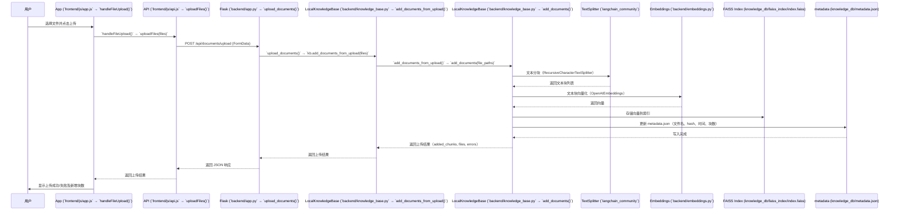

# 3. 上传文档

本文件详细说明“上传文档”功能的调用链，具体到每个环节涉及的文件与函数，并用 Mermaid 时序图展示全流程。

## 概要

- 功能：用户在前端选择文件上传，后端将文档分块、向量化、存储并更新元数据。
- 关键环节：前端表单提交、API 封装、Flask 路由、知识库管理、分块与向量化、元数据写入。

## 详细时序图（Mermaid）

## 具体文件与函数对照

- `frontend/js/app.js`：`handleFileUpload(files)` — 处理文件选择与上传逻辑。
- `frontend/js/api.js`：`uploadFiles(files)` — 发送 POST /api/documents/upload（FormData）。
- `backend/app.py`：`upload_documents()` — Flask 路由，接收上传请求，调用知识库方法。
- `backend/knowledge_base.py`：`add_documents_from_upload(files)` — 处理上传的 FileStorage 列表，保存临时文件。
- `backend/knowledge_base.py`：`add_documents(file_paths)` — 文本分块、向量化、存储、元数据更新。
- `langchain_community.text_splitters`：`RecursiveCharacterTextSplitter` — 文本分块。
- `backend/embeddings.py` 或 `langchain_openai`：`OpenAIEmbeddings` — 文本块向量化。
- `knowledge_db/faiss_index/index.faiss`：FAISS 索引文件，存储向量。
- `knowledge_db/metadata.json`：存储文件元数据与分块信息。

## 关键代码片段（便于快速定位）

- 路由入口：`backend/app.py` 的 `upload_documents()`
- 上传处理：`backend/knowledge_base.py` 的 `add_documents_from_upload()`、`add_documents()`
- 前端触发：`frontend/js/app.js` 的 `handleFileUpload()`、`frontend/js/api.js` 的 `uploadFiles()`

## 扩展建议

- 支持多文件批量上传，前端已用 FormData 多文件字段。
- 可在后端增加文件类型/大小校验，或上传进度回调。

---

作者：自动生成
日期：2025-12-24
