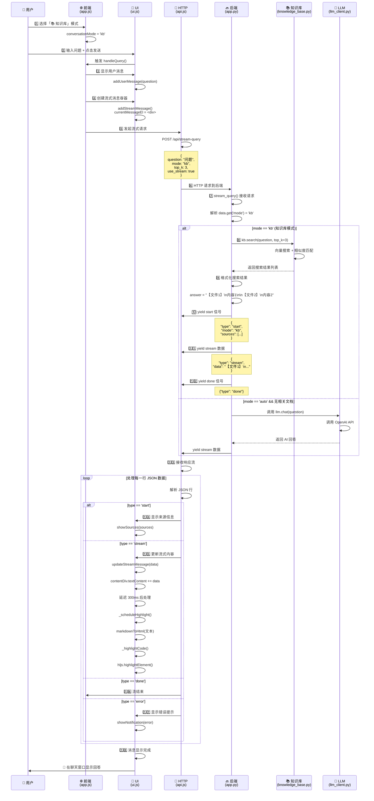
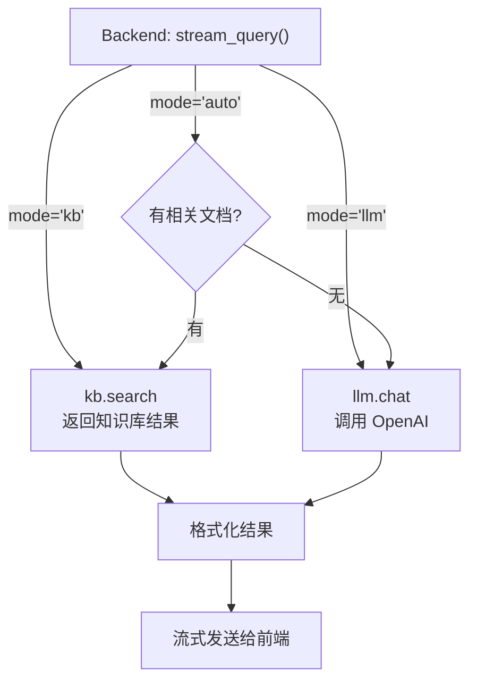

### 知识库回答时序图



---

## 📝 流程说明

### 核心步骤

| 步骤 | 发生位置 | 具体操作 |
|------|---------|---------|
| 1️⃣-2️⃣ | 前端 | 用户选择模式 + 输入问题 |
| 3️⃣-4️⃣ | 前端 UI | 显示用户消息 + 创建助手消息容器 |
| 5️⃣-6️⃣ | HTTP 请求 | 发送流式请求到后端 |
| 7️⃣-9️⃣ | 后端逻辑 | 根据模式调用对应函数（知识库/LLM） |
| 🔟-1️⃣2️⃣ | 后端响应 | 流式发送 start → stream → done |
| 1️⃣3️⃣-1️⃣8️⃣ | 前端处理 | 接收流数据 → 转换 Markdown → 高亮代码 |

### 知识库模式的关键函数

```
前端:  app.js handleStreamQuery()
       └─ api.js queryStream()
          └─ POST /api/stream-query

后端:  app.py stream_query()
       └─ if mode == 'kb':
          └─ kb.search()  ← 🔑 调用知识库搜索
             └─ 返回搜索结果
```

---

## 🎯 对比：三种模式

如果你改成 **auto** 或 **llm** 模式，只有这一块不同：

